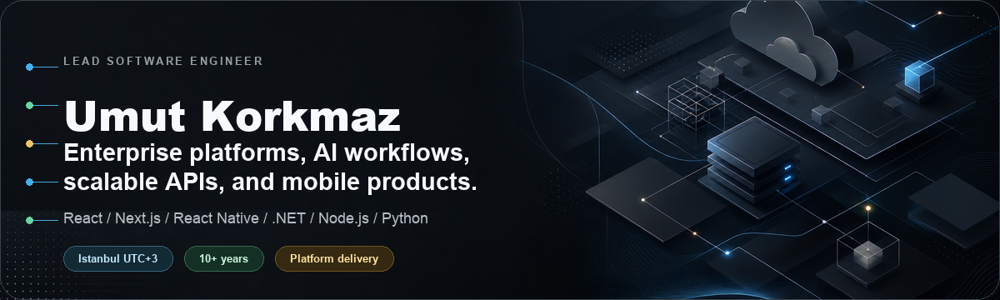

# Umut Korkmaz

  

Lead Software Engineer in Istanbul building enterprise platforms, commerce
systems, mobile products, and AI-enabled developer workflows.

[Website](https://umutkorkmaz.net) |
[LinkedIn](https://linkedin.com/in/umut-korkmaz) |
[Email](mailto:umutkorkmaz@outlook.com.tr) |
[GitHub](https://github.com/UmutKorkmaz)

I have 10+ years of experience shipping production software across
React/Next.js, React Native, .NET, Node.js, Python/FastAPI, Docker, Kubernetes,
Kafka, Redis, Elasticsearch, and cloud infrastructure. I combine hands-on
engineering with technical leadership: modernizing legacy systems, designing
scalable APIs, mentoring engineers, coordinating delivery across teams, and
turning ambiguous business problems into software that ships.

## Impact Snapshot

| Signal | Details |
| --- | --- |
| Enterprise modernization | Led Digiturk's DigiFlow modernization from ASP.NET 3.5 WebForms to React and .NET APIs across roughly 100 internal workflows. |
| Mobile product delivery | Delivered DigiPort App, a React Native New Architecture app used by 500+ daily active users across 2,000+ employees. |
| B2B platform leadership | Led an 8+ engineer team on Pometop, a multi-module supply-chain and e-commerce platform with 50+ active B2B accounts and 40+ industry categories. |
| Marketplace and AI features | Built Yazilimci Bul features for 40,000+ registered members, 500+ developer/agency profiles, AI matching, project analysis, estimates, and CV skill scoring. |
| Infrastructure reliability | Built hosting, domain, and server-management systems for 1,000+ customers with HAProxy, Patroni, PgBouncer, etcd, keepalived, Nginx, and Bind9. |
| Team leverage | Mentored engineers in React, .NET API development, Git workflows, modernization practices, and scalable delivery. |

## Selected Experience

| Role | Scope | Stack |
| --- | --- | --- |
| Lead Software Engineer, Digiturk | Modernizing internal workflow platforms, delivering employee mobile experiences, architecting AI-powered knowledge workflows, and using Redis selectively for high-throughput workflow/cache paths such as survey slides and stationery workflows. | React, React Native, .NET, Oracle, Redis, AI/SLM |
| Lead Software Engineer, Pometop | Leading a distributed team building a B2B supply-chain and commerce platform with Redis-backed distributed cache configuration for catalog/admin workloads and payment-conversation state. | React, Next.js, TypeScript, Node.js, .NET Core, SQL Server, Redis |
| Senior Software Engineer, Yazilimci Bul | Building Turkey's developer marketplace and AI-assisted project platform, including intelligent matching, project analysis, budget/timeline estimation, escrow, and admin workflows. | React, Node.js, Express, MongoDB |
| Full Stack Engineer / Team Lead, Makdos | Built commercial hosting, domain, server, support, and customer-management systems with high-availability infrastructure and realtime support features. | React, Next.js, Node.js, Python, FastAPI, PostgreSQL, Redis |
| Full Stack Developer, ISG Kurumsal | Delivered web applications, business websites, internal CRM workflows, and digital visibility improvements. | C#, .NET MVC, PHP, Laravel, jQuery, SQL Server, MySQL |

## Scalability and Infrastructure

| Tool | How I use it for scalability |
| --- | --- |
| Docker | Repeatable local stacks for databases, caches, analysis tools, and service containers; Docker-aware service scaffolds and compose files in Re-Shell. |
| Kubernetes | Re-Shell generates Deployments, Services, HPAs, NetworkPolicies, Helm charts, and GitOps assets from workspace configuration, including readiness/liveness boundaries. |
| Kafka | Re-Shell includes async transport and message-queue scaffolds with producers, consumers, topics, consumer groups, dead-letter behavior, and local compose support. |
| Redis | Digiflow uses selective Redis cache paths for high-throughput workflows; E-Export City uses Redis-backed Socket.io notification counters; Pometop uses Redis-backed distributed cache configuration for catalog/admin workloads and payment-conversation state. |
| Elasticsearch | Re-Shell templates cover full-text search, indexing, analytics, and ELK/EFK-style observability paths so search/log read models do not overload transactional data stores. |

## Open Source and Experiments

| Project | What it demonstrates | Stack |
| --- | --- | --- |
| [meridian](https://github.com/UmutKorkmaz/meridian) | .NET library with mediator and mapping packages, covering CQRS-style request/response, notifications, streams, pipeline behaviors, profiles, resolvers, converters, and query projection. | C#, .NET |
| [re-shell](https://github.com/UmutKorkmaz/re-shell) | Full-stack development platform CLI for distributed microservices and micro-frontends, including Docker-aware services, Kubernetes/Helm/GitOps manifests, Kafka/Redis async scaffolds, and Elasticsearch observability/search templates. | TypeScript, Node.js, Docker, Kubernetes, Kafka, Redis, Elasticsearch |
| [orkhon](https://github.com/UmutKorkmaz/orkhon) | From-scratch auditable LLM stack with Turkish and Old Turkic experiments. | Python |
| [quorate](https://github.com/UmutKorkmaz/quorate) | A council of AI reviewers for code in one CLI. | TypeScript |
| [code-pulse](https://github.com/UmutKorkmaz/code-pulse) | Privacy-first developer time tracking and productivity analytics for VS Code. | TypeScript |

## Core Stack

| Area | Tools and strengths |
| --- | --- |
| Frontend and mobile | React, Next.js, Vue, React Native New Architecture, TypeScript, Tailwind CSS, Zustand, Material UI, Three.js, Babylon.js |
| Backend and APIs | .NET, C#, Node.js, Express.js, Python, FastAPI, Entity Framework, SQLAlchemy, REST APIs, WebSockets, webhooks |
| Data and messaging | PostgreSQL, SQL Server, MySQL, MongoDB, Oracle Database, PL/SQL, Redis, Kafka, RabbitMQ, Elasticsearch |
| Cloud and infrastructure | Azure, Azure DevOps, AWS, Docker, Kubernetes, LXC, Nginx, OpenResty, HAProxy, IIS, Bind9, Knot, GitHub Actions |
| AI engineering | LLaMA, Small Language Models, RAG patterns, prompt engineering, LangChain, GitHub Copilot, Claude, ChatGPT, Cursor, Gemini |
| Architecture and quality | Microservices, distributed systems, CQRS, CI/CD, OOP, clean code, Jest, Vitest, Selenium, k6 |
| Payments | iyzico, PayTR, PayPal, Garanti Sanal POS, Kuveyt Turk Sanal POS |

## Education, Certifications, Languages

- Bachelor of Engineering in Computer Engineering, Istanbul Kultur University.
- Associate Degree in Computer Programming, Istanbul Kultur University.
- Certifications: Test Automation, Microservices Architecture, High Load
  Software Architecture.
- Turkish native, English C1.

## Open To

I am open to lead/senior full-stack engineering, AI integration, platform
modernization, API architecture, React Native product work, and technical
consulting around scalable systems.

For serious project, architecture, or collaboration conversations:
[umutkorkmaz.net](https://umutkorkmaz.net) or
[umutkorkmaz@outlook.com.tr](mailto:umutkorkmaz@outlook.com.tr).
